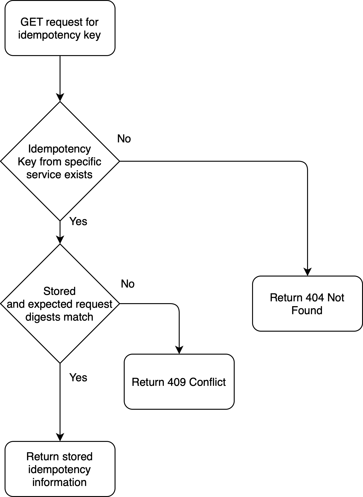
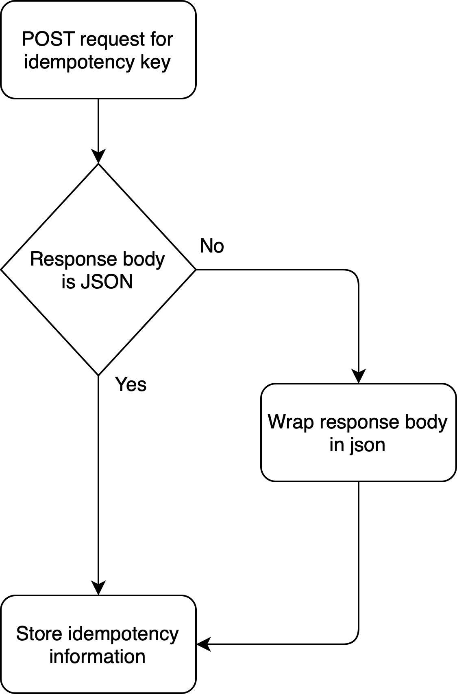
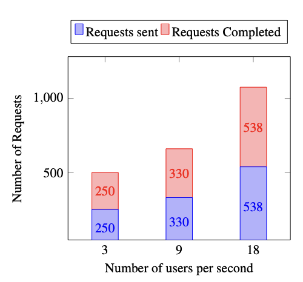

# Idempotency in Service Mesh: for Resiliency of Fog-Native Applications in Multi-Domain Edge-to-Cloud Ecosystems

## Preliminary

Fog-native applications (FNA) are microservice-based workflows, distributed over multiple ACSes. We assume each ACS to consist of at least one cluster.
Each cluster hosts a part of the application, and parts are stitched across clusters by peering of the border microservices. Peering is facilitated by the underlying service meshes managing the hosting clusters.
Each microservice in a FNA has a likelihood of failure, either due to microservice defects or a failure in the infrastructure, causing transient requests to be lost and need for request resend. Typically, the infrastructure provider has no knowledge of microservice defects, as they are outside their concern.
However, for cooperative management of FNAs, we assume the application provider shares 
a set of possible service defects that may cause failure, along with the recommended methods of resolving them.

FNAs require similar resiliency guarantees to those of CNAs, deployed within a single ACS. This is particularly the case for applications involving POST requests to a microservice(s). Because, without safe retries such requests are likely to create idempotency error storms that are difficult to trace and reconcile any data issues as a result. Recall that an idempotency storm is defined as the duplicate creation of resources due to compounded automated retries on non-idempotent requests.

The infrastructure ecosystem is that of multiple clouds (ACSes) of different size, connected by an external programmable network and possibly distributed between the network edge and core.
Service-based tunnels are established between microservices across clusters by service meshes, providing baseline service resiliency within each domain (i.e. for non-POST requests). Each microservice in a FNA is attached to a unique Envoy that provides connectivity within or across clusters. Each cluster has a service mesh control plane node that cooperates with its peers in other ACSes in managing their hosted FNAs.
All ACSes have the ability to synchronise on the state in near real-time.

## Idempotency DataStore Schema

```yaml
apiVersion: idempotency.example.com/v1alpha1
kind: DatastoreSchema
metadata:
  name: schema
spec:
  fields:
    - name: id
      type: uuid
      constraints:
        - "not null"
        - "primary key"
    - name: service_name
      type: string
      constraints:
        - "not null"
        - "primary key"
    - name: cluster_id
      type: string
      constraints:
        - "not null"
    - name: req_checksum
      type: string
      constraints:
        - "not null"
    - name: res_body
      type: json
    - name: status_code
      type: integer
      constraints:
        - "not null"
    - name: created date
      type: timestamp
      constraints:
        - "not null"
        - "default"
        - "current_timestamp"
    - name: completer downstream resource
      type: string
    - name: completed_at
      type: timestamp
```

## Settings of Execution Parameters

| Parameter                              | Setting     |
|----------------------------------------|----------------------|
| Number of Clusters                     | 2                    |
| Number of machines per cluster         | 2                    |
| Network Bandwidth between clusters     | 1G                   |
| CPU                                    | Intel i5-3570 4-core |
| Memory                                 | 8 GB                 |
| Number of users per second             | 3, 9, 18             |
| Total number of requests per benchmark | 90, 270, 540         |
| Distribution of requests               | Constant             |
| Duration of each benchmark             | 30 seconds           |

## Idempotency Service Flow Charts





## User Satisfaction

User satisfaction is analyzed for scenarios where a microservice suffers from a functional error; for which the application owner has provided the mesh with a developer-defined solver (a.k.a completer function).



The figure above shows the total number of completed requests (i.e. satisfied), compared to the total number of sent counterparts. The results show a consistent $100\%$ request completion rate, for error-prone microservices with a developer-defined solvers. 
The completion rate encompasses all requests for which a \verb|2xx| status code was initially returned to the client, and the request eventually completed. The high/consistent completion rate under different workloads illustrates the scalability of the system under variant working conditions.
